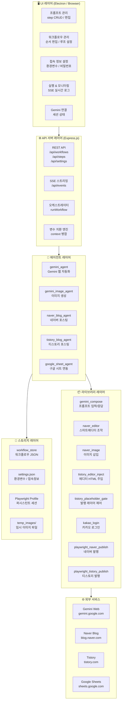
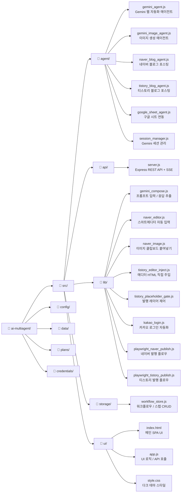
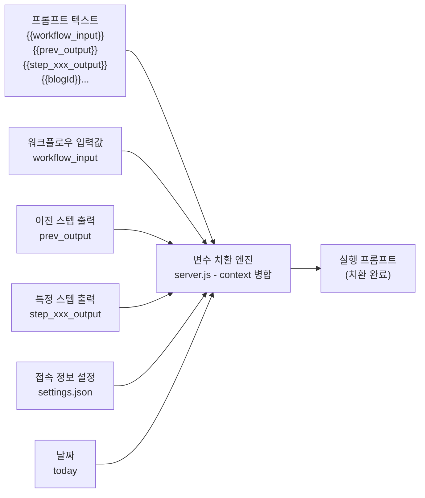

# 멀티 AI Agent 오케스트레이터 — 시스템 구성도

> 작성일: 2026-07-26  
> 버전: 1.0.0 (릴리스)  
> 지원 OS: macOS / Windows (Electron 패키징)

---

## 1. 전체 레이어 구성

---

## 2. 디렉터리 구조

---

## 3. 플러그인 타입 목록

각 워크플로우 스텝은 아래 플러그인 타입 중 하나로 동작합니다.

| 플러그인 타입 | 설명 | 담당 에이전트 |
|---|---|---|
| `plugin_gemini` | Gemini 웹 UI에 프롬프트를 입력하고 응답을 받음 | `gemini_agent.js` |
| `plugin_gemini_image` | Gemini 이미지 생성 API로 이미지 파일 생성 | `gemini_image_agent.js` |
| `plugin_naver_publish` | 네이버 스마트에디터에 글을 작성하고 발행 | `naver_blog_agent.js` |
| `plugin_tistory_publish` | 티스토리 에디터에 HTML 글을 삽입하고 발행 | `tistory_blog_agent.js` |
| `plugin_google_sheet` | 구글 시트에서 데이터를 읽거나 씀 | `google_sheet_agent.js` |

---

## 4. 변수 치환 시스템

워크플로우 실행 시 프롬프트 내의 `{{변수명}}` 패턴은 아래 규칙으로 자동 치환됩니다.

---

## 5. 기술 스택 요약

| 계층 | 기술 |
|---|---|
| 런타임 | Node.js 20 LTS |
| 데스크탑 패키징 | Electron + electron-builder |
| 브라우저 자동화 | Playwright (Chromium) |
| API 서버 | Express.js |
| UI | Vanilla HTML / CSS / JavaScript |
| 데이터 저장 | JSON 파일 (로컬) |
| 빌드 | electron-builder (Windows NSIS 인스톨러) |
