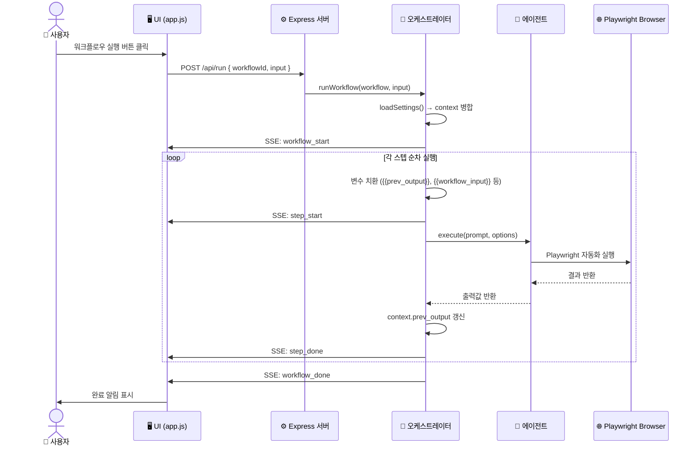
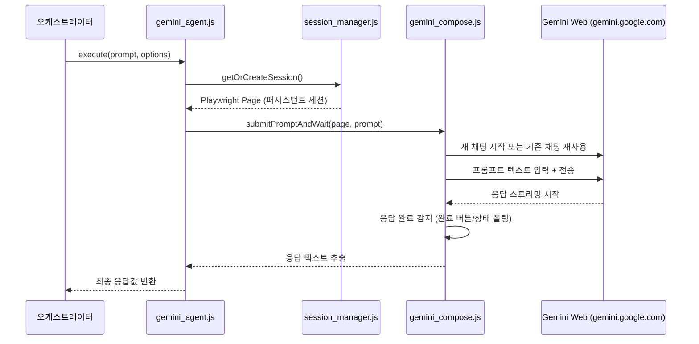
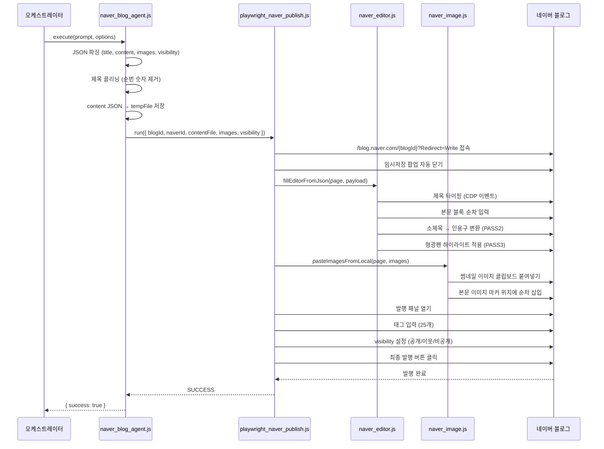
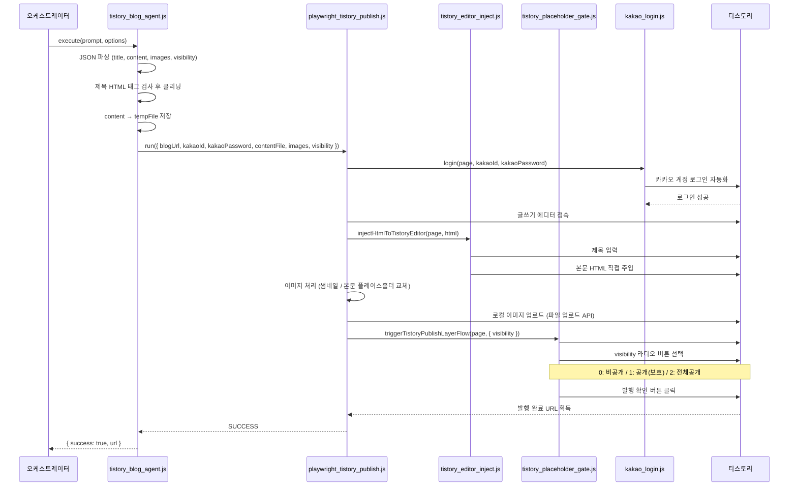
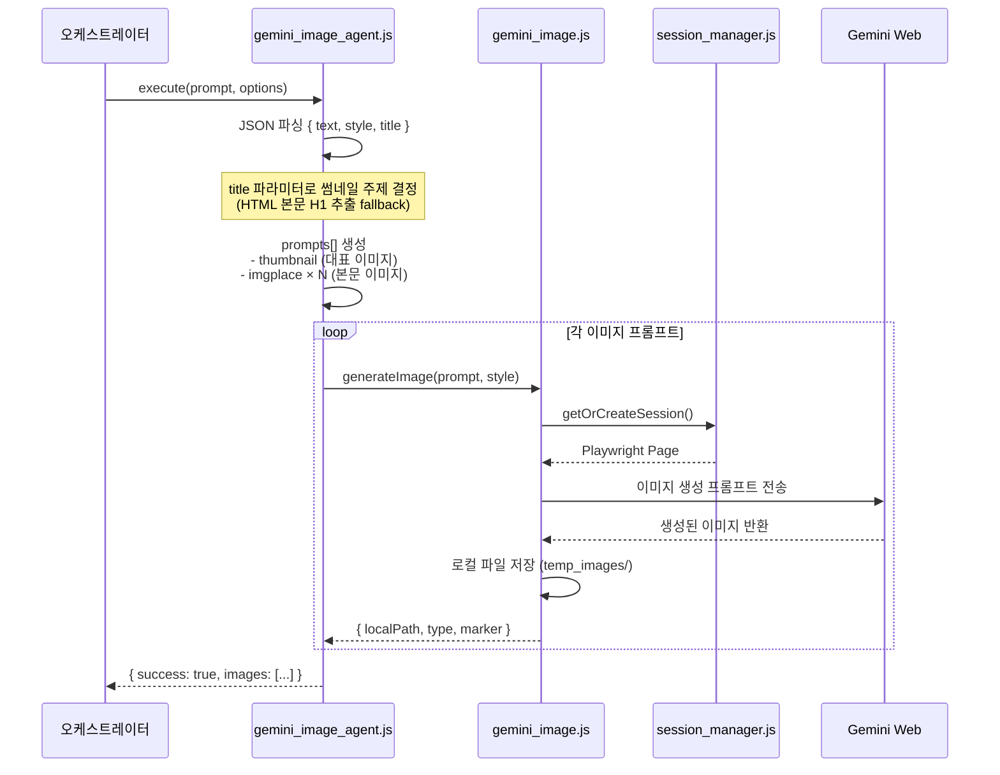
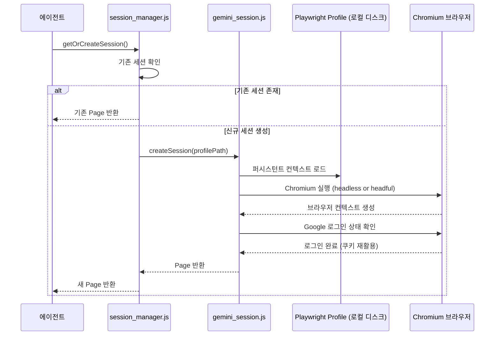

# 멀티 AI Agent 오케스트레이터 — 시퀀스 다이어그램

> 작성일: 2026-07-26  
> 버전: 1.0.0 (릴리스)

---

## 1. 워크플로우 전체 실행 흐름

---

## 2. Gemini 프롬프트 실행 시퀀스

---

## 3. 네이버 블로그 자동 포스팅 시퀀스

---

## 4. 티스토리 자동 포스팅 시퀀스

---

## 5. Gemini 이미지 생성 시퀀스

---

## 6. 세션 관리 시퀀스

