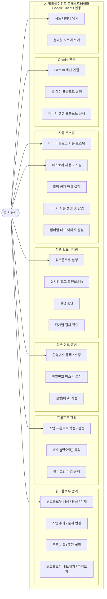
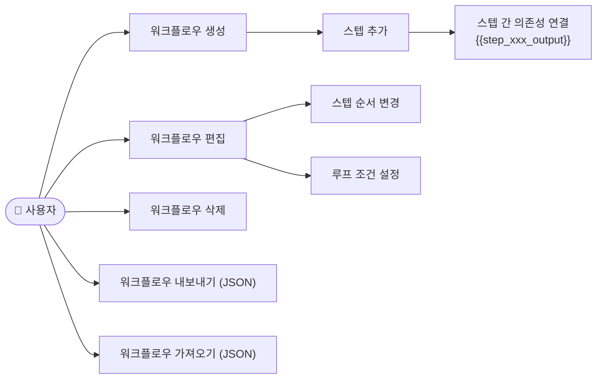
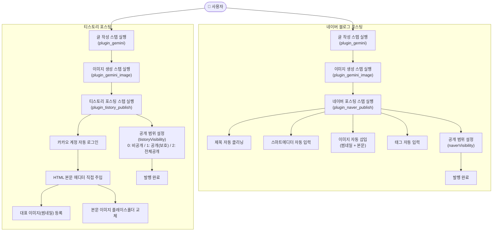
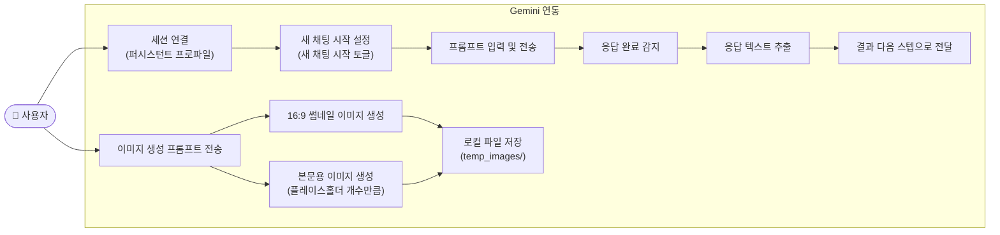
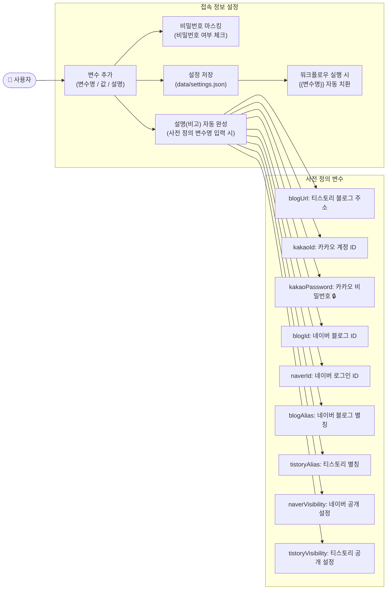
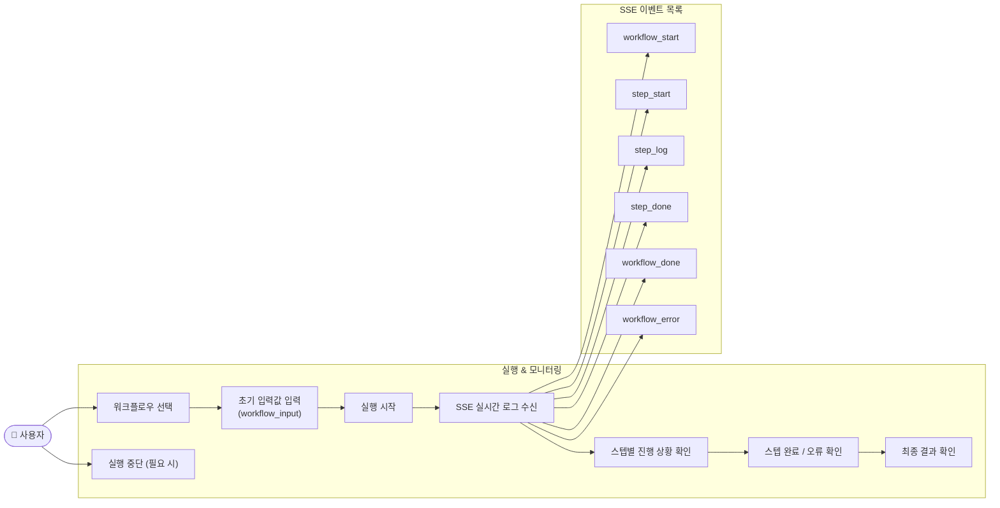

# 멀티 AI Agent 오케스트레이터 — 유스케이스 다이어그램

> 작성일: 2026-07-26  
> 버전: 1.0.0 (릴리스)

---

## 1. 전체 유스케이스 개요

---

## 2. 워크플로우 관리 유스케이스

---

## 3. 자동 포스팅 유스케이스

---

## 4. Gemini 연동 유스케이스

---

## 5. 접속 정보 & 환경변수 유스케이스

---

## 6. 실행 & 모니터링 유스케이스

